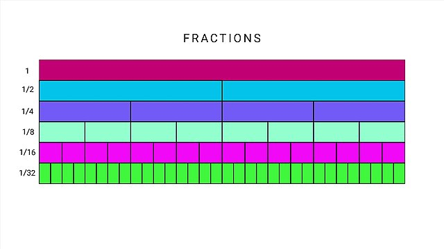

Numbers are more than just tools for counting—they reveal fascinating patterns and properties that have inspired mathematicians for centuries. In this experiment, you will explore two beautiful ideas in number theory: perfect numbers and continued fractions.

### 1. Perfect Numbers

A **perfect number** is a positive integer that is equal to the sum of its proper divisors (excluding itself). For example:

- 6 is perfect because its divisors (other than itself) are 1, 2, and 3, and $1 + 2 + 3 = 6$.
- 28 is perfect because $1 + 2 + 4 + 7 + 14 = 28$.

Perfect numbers are rare and have fascinated mathematicians since ancient times. They are connected to Mersenne primes and have deep links to the history of mathematics. The search for large perfect numbers is still an active area of research.

**How to check for a perfect number?**

To check if $N$ is perfect, sum all its divisors less than $N$ and compare the sum to $N$. Efficient algorithms only check up to $\sqrt{N}$ and use divisor pairs.

**Example:**

> Input: 28  
> Output: YES  
> Input: 16  
> Output: NO

**Sample Calculation:**

For 28:

- Divisors (excluding 28): 1, 2, 4, 7, 14
- Sum: $1 + 2 + 4 + 7 + 14 = 28$ (Perfect)

For 60:

- Divisors (excluding 60): 1, 2, 3, 4, 5, 6, 10, 12, 15, 20, 30
- Sum: $1 + 2 + 3 + 4 + 5 + 6 + 10 + 12 + 15 + 20 + 30 = 108$ (Not perfect)

### 2. Continued Fractions

 <small>Visualization of fractions and their parts</small>

Every positive rational number can be written as a **continued fraction**:

$$ \frac{a}{b} = q_1 + \frac{1}{q_2 + \frac{1}{q_3 + \cdots}} $$

where $q_1, q_2, \ldots$ are integers. Continued fractions reveal hidden patterns in numbers and are used in cryptography, computer arithmetic, and more.

**How to compute the continued fraction?**

Given two integers $a$ and $b$ ($a > b > 0$):

1. Divide $a$ by $b$ to get quotient $q_1$ and remainder $r_1$.
2. Replace $(a, b)$ with $(b, r_1)$ and repeat until the remainder is 0.
3. The sequence of quotients is the continued fraction.

**Example:**

> Input: 239 51  
> Output: 4 1 2 5 2  
> Input: 27 10  
> Output: 2 1 2 2

**Sample Calculation:**

For $\frac{239}{51}$:

- $239 \div 51 = 4$ remainder 35
- $51 \div 35 = 1$ remainder 16
- $35 \div 16 = 2$ remainder 3
- $16 \div 3 = 5$ remainder 1
- $3 \div 1 = 3$ remainder 0
- Sequence: 4, 1, 2, 5, 2

### Why Study the Beauty of Numbers?

Exploring these properties helps you:

- Appreciate the elegance and structure in mathematics.
- Develop efficient algorithms for number-theoretic problems.
- Connect mathematical ideas with practical programming.

---

_This experiment encourages you to implement algorithms for perfect numbers and continued fractions, deepening your understanding of number theory and programming._
